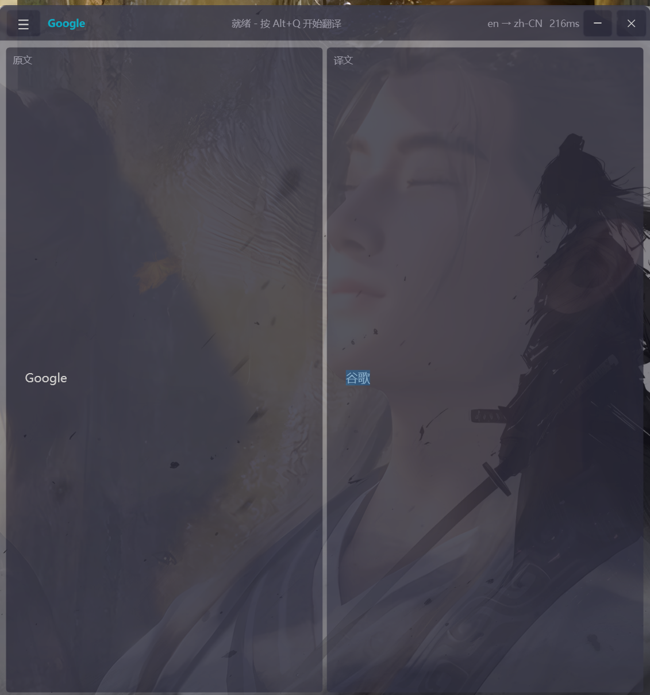
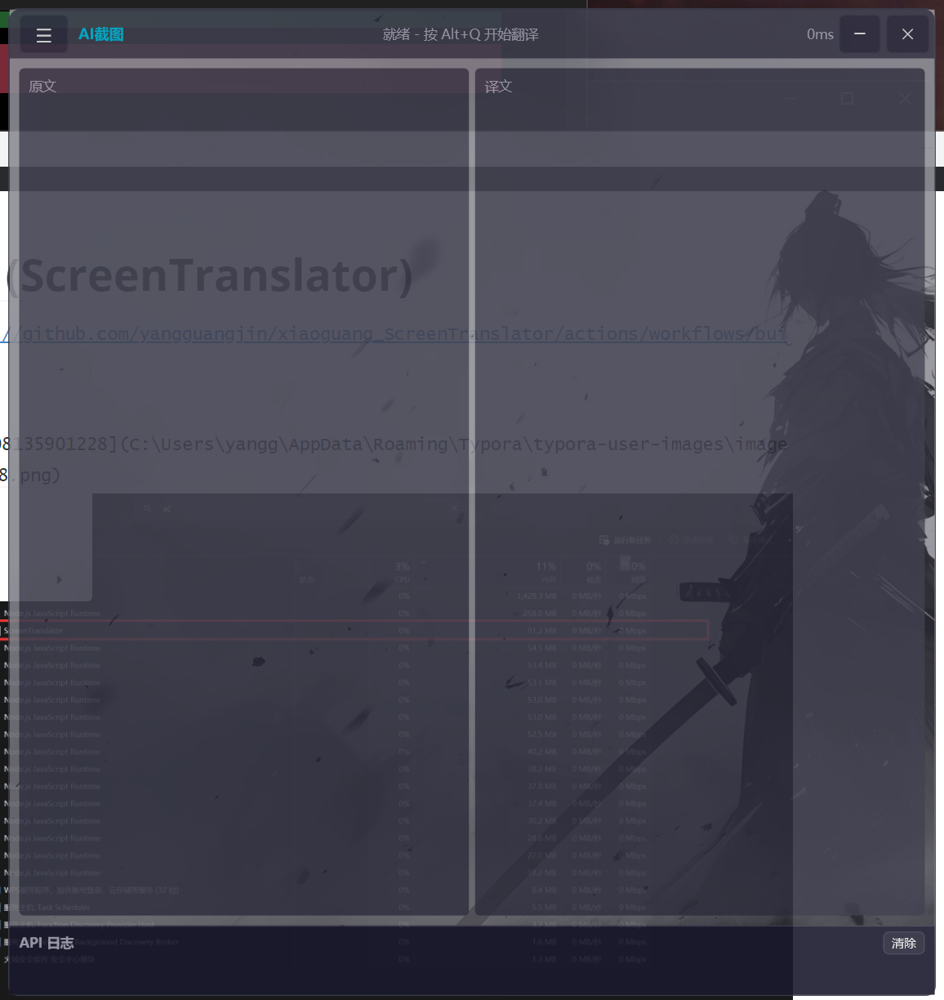
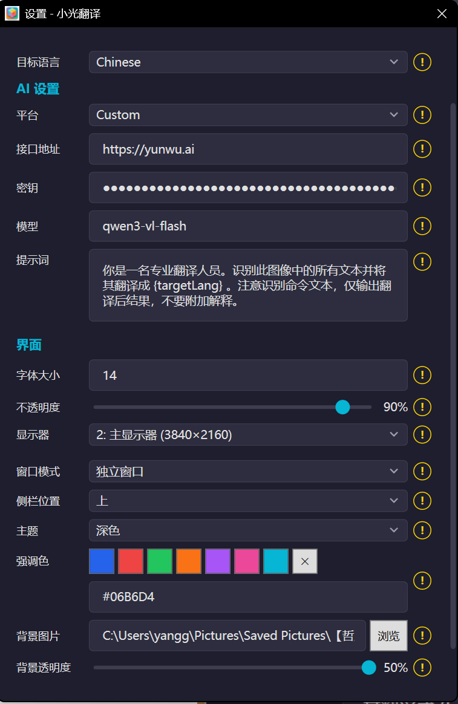
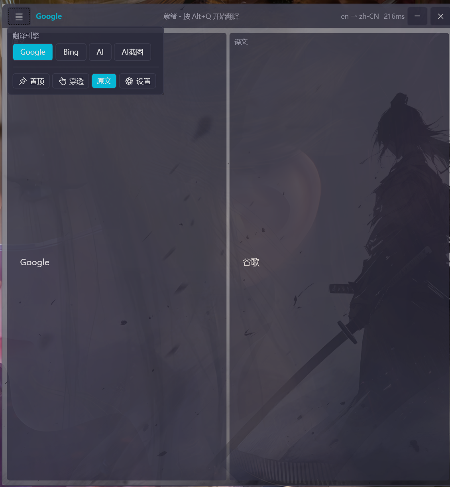
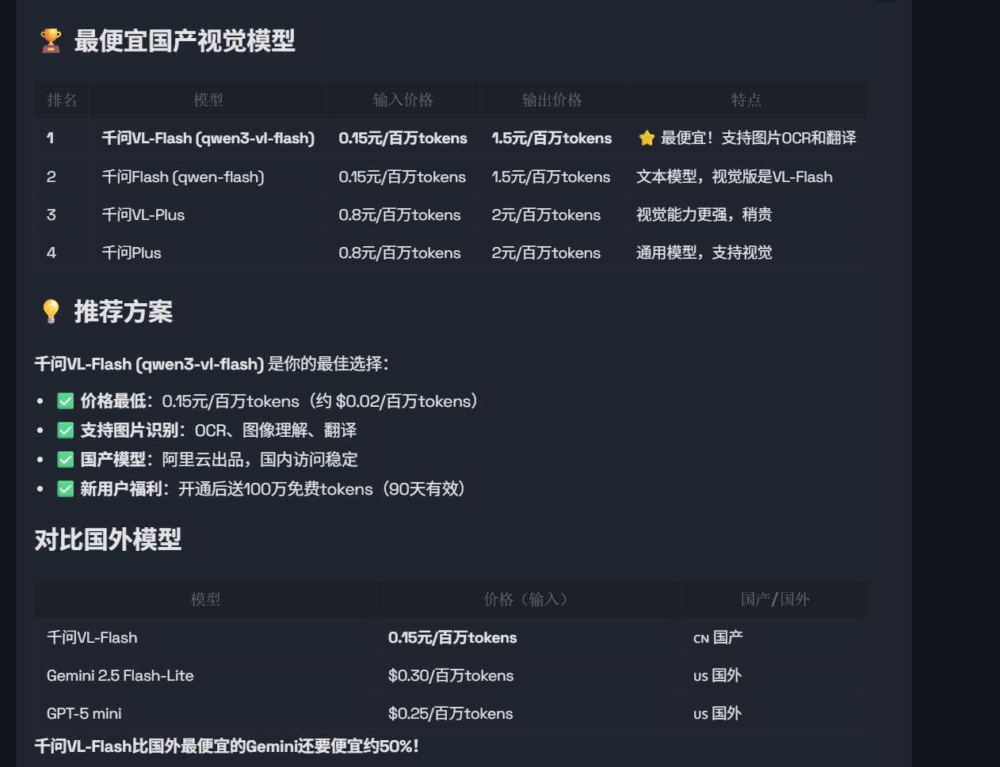
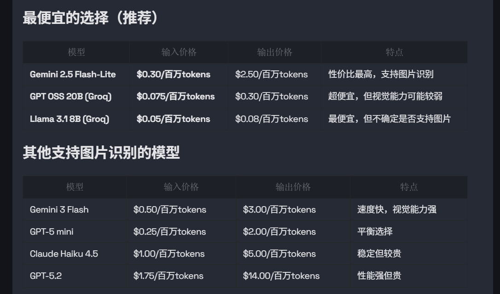
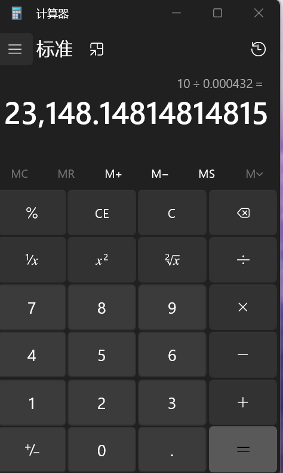

# 小光翻译 (ScreenTranslator)

[](https://github.com/yangguangjin/xiaoguang_ScreenTranslator/actions/workflows/build.yml)
[](https://www.apache.org/licenses/LICENSE-2.0)











**超轻量级** Windows 屏幕翻译工具。快捷键框选屏幕区域，AI 大模型智能翻译，多显示器双栏显示。

> 无广告 | 开源免费 | 超轻量 | AI 驱动 | 多显示器 | 高度自定义

## 为什么选择小光翻译？

- **超轻量** — 无本地 OCR 引擎，无臃肿依赖，安装包小、内存占用低

- **智能准确** — 自定义提示词 ,依赖 AI 大模型（GPT / Claude / Gemini/custom）进行文字识别和翻译，准确度远超传统 OCR

- **多引擎** — 支持 OpenAI / Claude / Gemini / DeepSeek /各种api中间商 等

- **多显示器** — 完整支持多屏环境，框选任意屏幕区域，结果显示在指定显示器

- **罗技外设** — 支持罗技鼠标侧键（XButton1/XButton2）作为快捷键触发翻译

- **高度自定义** — 深色/浅色主题、自定义强调色、背景图片、窗口透明度、侧边栏模式

- **无广告** — 完全开源，Apache 2.0 协议，无任何广告和数据收集(是否厌倦了市面上的N多翻译软件?)

- **开机自启** — 支持开机自动启动，随时待命

- **不仅仅是翻译,你可以自己修改提示词, 看图写作文,看图写代码什么都可以
	主要就是快捷键截图+AI识别 = 输出你想要的结果  各种场景任你发掘

  未来:

- AI眼镜支持:  多屏幕看不不过来? 一个屏幕被其他东西影响(又要写代码,又要查看翻译文档)? 电脑上截图,翻译结果传回AI眼镜,本地局域网/蓝牙 (后续对接ai眼镜厂商sdk)

- 翻译结果语音到手机播放/蓝牙耳机


## 为什么不选择小光翻译？
- 为什么不加入OCR?  最初版本是有OCR的,但是我个人在工作中实际使用下来, AI模型加持的截图翻译最好用效果最好,工作体验非常丝滑舒适,对于一些命令和公式行/表格数据识别非常好, 比本地OCR好太多, 加入OCR太依赖OCR引擎本身识别能力, 占用还大, 现在AI能力这么强为什么不吃上AI红利?
- 需要联网: 没办法啊   或者你使用本地局域网部署的模型
- 为什么不加入免费的本地翻译功能: 
	难用啊,自己试过了(一些引擎,截图识别一坨,不能很好识别公式和命令,省这个钱降低效率?,还要下载离线包,占用大),哪有AI智能,还能自己识别文档命令公式 (最初版本有这个功能,不好用就删掉了)
	如果你只是简单的翻译单词,使用市面上其他翻译软件即可,如果你和我一样,经常频繁阅读外网论文,文献资料, 每次都要平繁复制翻译,又在意翻译结果可靠性 ,那么这款高效率的软件在适合不过,希望能够帮到你

## 为什么开发这个软件?

我自己4个显示器

一个写代码,

一个浏览网页查阅资料,

一个是各自工具(ssh,数据库软件等),

还有一个就是翻译结果,笔记记录专用显示,不可避免要查阅外网论文,文档等


市面上其他的难用啊, 要不要你登录,充会员有广告,占用还大,一些花里胡哨的功能,操作麻烦 功能臃肿又恶心....

索性自己开发了一个,我自己是多屏幕,一个主要查阅翻译外网文档, 另外一个屏幕显示结果, 阅读效率翻了好几倍


推荐模型(无广子,自己选择合适自己的): 

需要准确率高的, 其他小语种的用gemini或者其他你喜欢的模型(需要支持图片识别), 支持api key代理中间商,比如云雾api


国内日常使用,使用千问的即可,便宜速度又快,10块钱的api额度,够你用好久,比那些什么按字数翻译收费的好无数倍

0.15元100万token ,打个比方, 输入英文每个1token  输出中文每个2token   

那么你0.15元可以翻译100W的英文token, 假如输出的结果是50W中文(可能还包括一些什么推理的)= 0.15+0.75 一块多钱不到,每个月给翻译软件充的VIP换成大模型api,够你用到天荒地老好吧


使用技巧: 尽可能给一段文字截图进行翻译,不要每个单词都截图请求一遍,因为请求ai模型每次都会带 提示词token, 减少不必要的token消耗

实际用下来10块钱的api额度,我用几个月都用不完.....  你截图翻译单个单词用用便宜的模型,成本影响其实也不是很大







  10块钱可以总共翻译2.3W次图片,还不是月付的,用到才扣





## 功能特性

| 功能 | 说明 |
|------|------|
| AI 截图翻译 | 框选屏幕区域，AI 视觉模型直接翻译截图（默认模式） |
| 多平台 AI | OpenAI / Claude / Gemini / 自定义 OpenAI 兼容端点 |
| 全局快捷键 | 键盘组合键或鼠标侧键触发 |
| 多显示器 | 框选任意屏幕，结果显示在指定显示器 |
| 双栏显示 | 原文/译文左右对照，可拖拽调整比例 |
| 窗口模式 | 独立窗口 / 侧边栏吸附（左/右/上/下） |
| 主题 | 深色/浅色 + 自定义强调色 + 背景图片 |
| 窗口控制 | 置顶、鼠标穿透、透明度调节 |
| 系统托盘 | 关闭窗口最小化到托盘，双击恢复 |
| 开机自启 | 注册表自启动 |

## 安装

### 方式一：下载压缩包

从 [Releases](https://github.com/yangguangjin/xiaoguang_ScreenTranslator/releases) 页面下载最新的 `ScreenTranslator-x.x.x.zip`，解压后直接运行 `ScreenTranslator.exe`。

### 方式二：从源码构建

```bash
git clone https://github.com/yangguangjin/xiaoguang_ScreenTranslator.git
cd xiaoguang_ScreenTranslator
dotnet restore
dotnet build
dotnet run --project ScreenTranslator
```

发布独立 exe + zip 压缩包：

```bash
build.bat
```

## 系统要求

| 项目 | 要求 |
|------|------|
| 操作系统 | Windows 10/11 64 位 |
| 运行时 | 无需安装（自包含发布） |
| 内存 | 建议 1GB 以上 |
| 网络 | 使用翻译功能时需联网 |

> 无需安装 .NET 运行时，无需 Visual C++ Redistributable，无需 AVX2 指令集，无需下载 OCR 模型。解压即用。

## 快速开始

1. 安装并启动程序
2. 打开设置（点击 `☰` → `⚙ 设置`），配置 AI API Key
3. 按 `Alt+Q`（默认快捷键），框选屏幕上要翻译的区域
4. 翻译结果自动显示在主窗口

## 翻译模式

| 模式 | 工作流程 | 适用场景 |
|------|----------|----------|
| **AI截图**（默认） | 截图 → AI 视觉翻译 | 通用，一步到位 |

## AI 翻译配置

### OpenAI

| 设置项 | 值 |
|--------|-----|
| 平台 | `OpenAI` |
| 接口地址 | `https://api.openai.com` |
| 密钥 | 你的 API Key（`sk-` 开头） |
| 模型 | `gpt-4o-mini`（经济）/ `gpt-4o`（高质量） |

### Claude (Anthropic)

| 设置项 | 值 |
|--------|-----|
| 平台 | `Claude` |
| 接口地址 | `https://api.anthropic.com` |
| 密钥 | 你的 Anthropic API Key |
| 模型 | `claude-sonnet-4-20250514` / `claude-haiku-4-20250414` |

### Gemini (Google)

| 设置项 | 值 |
|--------|-----|
| 平台 | `Gemini` |
| 接口地址 | `https://generativelanguage.googleapis.com` |
| 密钥 | 你的 Google AI API Key |
| 模型 | `gemini-2.0-flash` / `gemini-2.5-pro-preview-06-05` |

### 自定义端点（DeepSeek / Ollama 等）

| 设置项 | 值 |
|--------|-----|
| 平台 | `Custom` |
| 接口地址 | `https://api.deepseek.com` 或 `http://localhost:11434` |
| 密钥 | 对应密钥（Ollama 可填任意值） |
| 模型 | `deepseek-chat` / `qwen2.5:7b` 等 |

## 快捷键

设置窗口中点击热键输入框，按下组合键即可录入。

**支持的触发方式：**

- 键盘组合键：`Alt+Q`、`Ctrl+Shift+T`、`Ctrl+Alt+Z` 等
- 鼠标侧键：`XButton1`、`XButton2`（罗技等鼠标的侧键）
- 组合：`Ctrl+XButton1`、`Alt+XButton2` 等

## 自定义主题

| 设置项 | 说明 |
|--------|------|
| 主题 | 深色 / 浅色 |
| 强调色 | 多 种预设色 + 自定义 hex 值，影响按钮、标题等元素颜色 |
| 背景图片 | 选择图片作为主窗口背景 |
| 背景透明度 | 调节背景图片的透明度（5%~50%） |
| 窗口透明度 | 调节整个窗口的不透明度 |

## 目标语言

几乎全部：大模型支持的都支持

## 配置文件

```
%USER%\%APPDATA%\ScreenTranslator\settings.json
```

JSON 格式，可直接编辑。删除后重启程序恢复默认设置。

## 常见问题

**Q: 提示"已在运行中"**
程序仅允许单实例。检查系统托盘是否已有图标，右键退出后重新启动。

**Q: 快捷键无法注册**
该快捷键已被其他程序占用，在设置中修改为其他组合键。

**Q: 翻译结果为空或报错**

- 检查网络连接
- 检查 AI API Key 是否正确、端点是否可访问、模型名是否正确

**Q: 如何完全退出？**
点击 `✕` 只会隐藏到托盘。右键系统托盘图标 → `退出`。

**Q: 窗口位置如何重置？**
删除 `%APPDATA%\ScreenTranslator\settings.json`，重启程序。

## 许可证

[Apache License 2.0](LICENSE)
